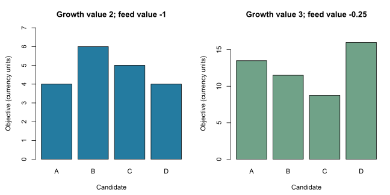

# Define a breeding objective


This is a self-contained base-R teaching example. It does not call a scientific
gsel API; those interfaces remain proposed. No external data or simulation
is required, and the website displays the code without executing it.

Learn to combine trait breeding values into an explicit objective and see how
trait units and economic priorities affect candidate rankings.

## State what improvement is worth

Suppose growth gain and feed intake are measured in kg over the same fixed
production period. More growth is desirable; additional feed has a cost.
For an illustrative objective, one extra kg of growth is worth two currency
units and one extra kg of feed costs one unit:

$$H=2u_{growth}-u_{feed}.$$

The $u$ values below are **supplied hypothetical additive breeding values**,
expressed as deviations from the same fixed genetic base. They are not raw
phenotypes or fitted estimates, and the economic values are teaching inputs,
not recommendations for a real production system.

## Work through the calculation

```r
# Supplied additive breeding-value deviations on a fixed reference base.
# Both traits are measured in kg over the same production period.
u <- rbind(A = c(growth = 5, feed = 6),
           B = c(growth = 4, feed = 2),
           C = c(growth = 3, feed = 1),
           D = c(growth = 6, feed = 8))

# Hypothetical marginal values: currency units per kg.
a <- c(growth = 2, feed = -1)
stopifnot(identical(colnames(u), names(a)))
H <- drop(u %*% a)
ranking <- rank(-H, ties.method = "min")

# A different breeding objective changes the preferred candidate.
a_growth <- c(growth = 3, feed = -0.25)
H_growth <- drop(u %*% a_growth)

# Change growth from kg to g, with the corresponding value per g.
u_grams <- u
u_grams[, "growth"] <- 1000 * u_grams[, "growth"]
a_grams <- a
a_grams["growth"] <- a_grams["growth"] / 1000
H_grams <- drop(u_grams %*% a_grams)
reference <- list(u = u, a = a, H = H, ranking = ranking,
                  a_growth = a_growth, H_growth = H_growth, H_grams = H_grams)
```

| Candidate | Growth | Feed | Objective H | Rank |
| --- | ---: | ---: | ---: | ---: |
| A | 5 | 6 | 4 | 3 |
| B | 4 | 2 | 6 | 1 |
| C | 3 | 1 | 5 | 2 |
| D | 6 | 8 | 4 | 3 |

B ranks first despite having less growth than D. A and D tie; this arithmetic
does not supply a tie-breaking selection rule. It also imposes no eligibility,
family, contribution or mating constraints.



Giving growth a value of 3 and feed a cost of only 0.25 changes the highest
objective to D. This changes the breeding goal itself. The two panels use
different y-axis ranges; compare the rankings within each objective, rather
than interpreting bar-height differences as observed genetic gain.

## Units and a mathematical extension

For named traits, $H=a^T u$, where $a$ contains marginal economic values per
trait unit. If growth is converted from kg to g, its economic value must be
divided by 1,000. `H_grams` then equals `H` exactly up to floating-point
precision. Multiplying every economic value by the same positive constant
changes the objective scale but preserves all rankings and ties.

Real breeding objectives require a declared production system, time horizon,
genetic base and economically justified values. Nonlinear profit, changing
prices or constraints may need a more detailed model than this fixed linear
objective. The distinction between breeding-goal values and index weights is
central to [selection-index theory (Hazel, 1943)](https://doi.org/10.1093/genetics/28.6.476).

## Try it yourself

1. Set the feed economic value to zero. Which candidate ranks first?
2. Multiply both original values by ten. Do the rankings change?
3. Convert growth to g without changing its economic value. Why is that wrong?

**Check your answers:** D is first when only growth matters. Positive uniform
scaling preserves the ranks. Failing to adjust the growth value makes its
contribution 1,000 times larger and unintentionally changes the objective.

Continue with [construct a selection index](selection-indices.md), where the
available measurements are imperfect information about breeding values.

## Run the complete example

Copy the R code above into RStudio, or source the installed example:

```r
source(system.file("examples", "breeding_objectives.R",
                   package = "gsel", mustWork = TRUE))
reference
plot_tutorial()
```

The complete [R script](../../inst/examples/breeding_objectives.R) includes the plotting
helper. From a cloned repository, it can also be sourced directly from
`inst/examples/breeding_objectives.R`. The small helper exists only in the teaching script;
it is not exported by the package. The static figure is reproduced from that
script using the developer instructions in the [website guide](../../website/README.md).
