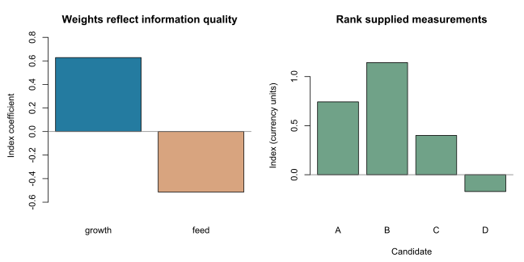

# Construct a selection index


This is a self-contained base-R teaching example. It does not call a scientific
gsel API; those interfaces remain proposed. No external data or simulation
is required, and the website displays the code without executing it.

Learn to predict a breeding objective from imperfect measurements using
supplied covariance inputs, then rank a small candidate set.
Start with [breeding objectives](breeding-objectives.md).
The four candidates below form a separate toy dataset; their measurements are
not generated from the preceding tutorial's supplied breeding values.

## Separate the objective from available information

The objective remains $H=a^T u$, with growth and feed values $a=(2,-1)^T$.
In practice, true additive breeding values $u$ are unavailable. Let $x$ contain
two centered measurements, and construct an index $I=b^T x$.

We supply hypothetical population covariances:

- $P=\operatorname{Var}(x)$: covariance among the measurements;
- $C=\operatorname{Cov}(x,u)$: cross-covariance between measurements and breeding values;
- $G=\operatorname{Var}(u)$: covariance among breeding values.

These moments describe a declared reference population and are not estimated
from the four demonstration candidates. Both measurement traits use kg, but
measurements and breeding values have different statistical roles.
Do not automatically substitute $G$ for $C$ when the information comprises
arbitrary predictions or measurements.

## Work through the calculation

```r
# Centered measurements x and additive breeding values u are different.
# Measurement values below use a fixed external reference mean.
traits <- c("growth", "feed")
x <- rbind(A = c(growth = 2, feed = 1),
           B = c(growth = 1, feed = -1),
           C = c(growth = -1, feed = -2),
           D = c(growth = 3, feed = 4))
a <- c(growth = 2, feed = -1)

# Hypothetical population moments; not estimates from these four candidates.
P <- matrix(c(4, 1, 1, 9), nrow = 2,
            dimnames = list(traits, traits))  # Var(x)
C <- diag(c(1, 4))                          # Cov(x, u)
G <- diag(c(2, 5))                          # Var(u)
dimnames(C) <- dimnames(G) <- list(traits, traits)
stopifnot(identical(colnames(x), rownames(P)),
          identical(colnames(C), names(a)))

# Solve the best-linear-prediction covariance equation P b = C a.
b <- drop(solve(P, C %*% a))
I <- drop(x %*% b)
naive_score <- drop(x %*% a)
variance_I <- drop(crossprod(b, P %*% b))
covariance_I_H <- drop(crossprod(b, C %*% a))
variance_H <- drop(crossprod(a, G %*% a))
accuracy <- covariance_I_H / sqrt(variance_I * variance_H)
reference <- list(P = P, C = C, G = G, a = a, b = b,
                  x = x, I = I, naive_score = naive_score,
                  variance_I = variance_I, covariance_I_H = covariance_I_H,
                  variance_H = variance_H, accuracy = accuracy)
```

The equation gives $b=(22/35,-18/35)^T$, approximately $(0.629,-0.514)^T$.
The economic values describe what matters; these coefficients additionally
reflect the supplied information quality and covariance among measurements.

| Candidate | Growth measurement | Feed measurement | Index I | Index rank |
| --- | ---: | ---: | ---: | ---: |
| A | 2 | 1 | 26/35 | 2 |
| B | 1 | -1 | 40/35 | 1 |
| C | -1 | -2 | 14/35 | 3 |
| D | 3 | 4 | -6/35 | 4 |

Negative values are deviations from the external reference means. We do not
recenter these four candidates. Applying economic values directly to $x$
instead gives scores 3, 3, 0 and 2, including a tie between A and B.



## Mathematical extension

Minimizing the population mean squared prediction error of $H$ among linear
indices gives the covariance equation

$$Pb=Ca.$$

We solve the system rather than explicitly forming an inverse. With a symmetric
positive-definite $P$, the solution is unique. Covariance matrices must also
be mutually compatible; the joint covariance of $(x,u)$ must be positive
semidefinite. The supplied example satisfies this condition.

The index variance and its covariance with the objective are both $116/35$;
the objective variance is 13. Consequently the model-implied correlation is

$$r_{IH}=\sqrt{\frac{116}{455}}\approx 0.505.$$

This is accuracy implied by the supplied moments, not out-of-sample accuracy
measured from data. No true breeding values or observed offspring outcomes are
used to rank these candidates. Normality is not required for this best-linear
projection, but response-to-selection formulas require their own assumptions.
This example neither fits a predictor nor claims realized gain.
For the classical formulation, see [Hazel (1943)](https://doi.org/10.1093/genetics/28.6.476).

## Try it yourself

1. Remove the off-diagonal measurement covariance in P. What coefficients result?
2. Double both economic values. What happens to the index and its accuracy?
3. Reorder traits in x without reordering the matrices. Why is that unsafe?

**Check your answers:** diagonal P gives coefficients $(1/2,-4/9)^T$.
Doubling a doubles b and I, preserving ranks and positive correlation accuracy.
Unmatched trait ordering combines the wrong quantities; use labels and explicit
alignment rather than relying on coincident row positions.

## Run the complete example

Copy the R code above into RStudio, or source the installed example:

```r
source(system.file("examples", "selection_indices.R",
                   package = "gsel", mustWork = TRUE))
reference
plot_tutorial()
```

The complete [R script](../../inst/examples/selection_indices.R) includes the plotting
helper. From a cloned repository, it can also be sourced directly from
`inst/examples/selection_indices.R`. The small helper exists only in the teaching script;
it is not exported by the package. The static figure is reproduced from that
script using the developer instructions in the [website guide](../../website/README.md).
